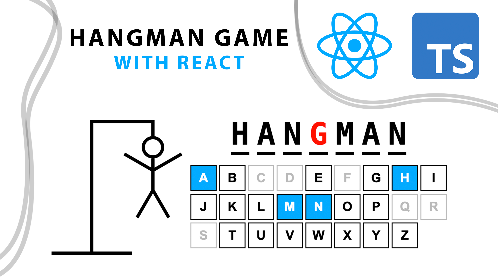

# Hangman Game With React and TypeScript in Hindi  | Great Beginner React/TypeScript Project

The Hangman Game with React and TypeScript is an engaging and educational project that combines the power of the React library with the type safety of TypeScript to recreate the classic word-guessing game. This interactive web application challenges players to guess a hidden word letter by letter, with each incorrect guess contributing to the drawing of a hangman.

Developers undertaking this project can expect to enhance their React skills by implementing dynamic user interfaces that respond to player input. The inclusion of TypeScript brings static typing to the game, enabling developers to catch potential errors during development and improve code quality.

Players will enjoy a seamless and responsive gaming experience, and developers can delve into features such as random word generation, state management, and conditional rendering. The Hangman Game with React and TypeScript serves as an excellent opportunity for developers to practice their front-end development skills in a fun and interactive context while leveraging the benefits of TypeScript for a more robust and maintainable codebase. Whether you're a beginner seeking a hands-on project or an experienced developer looking to reinforce your React and TypeScript proficiency, this Hangman Game offers an entertaining and educational coding challenge.
